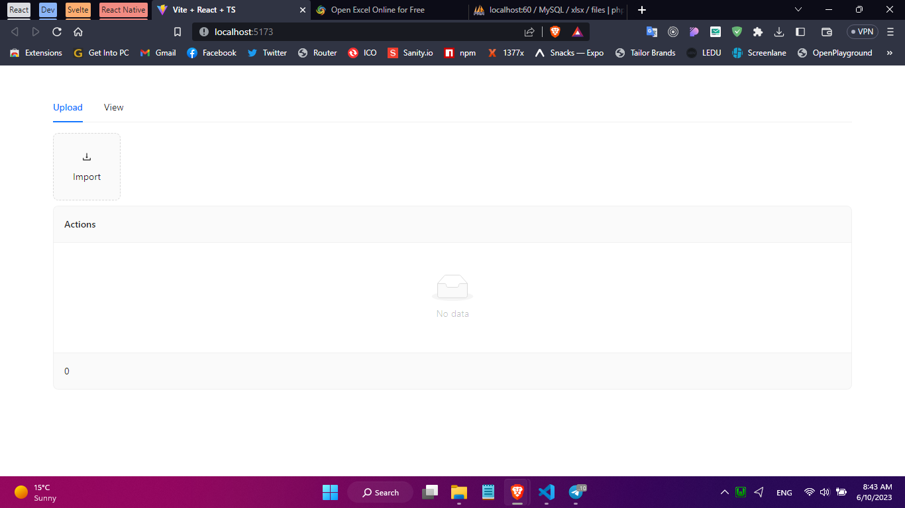
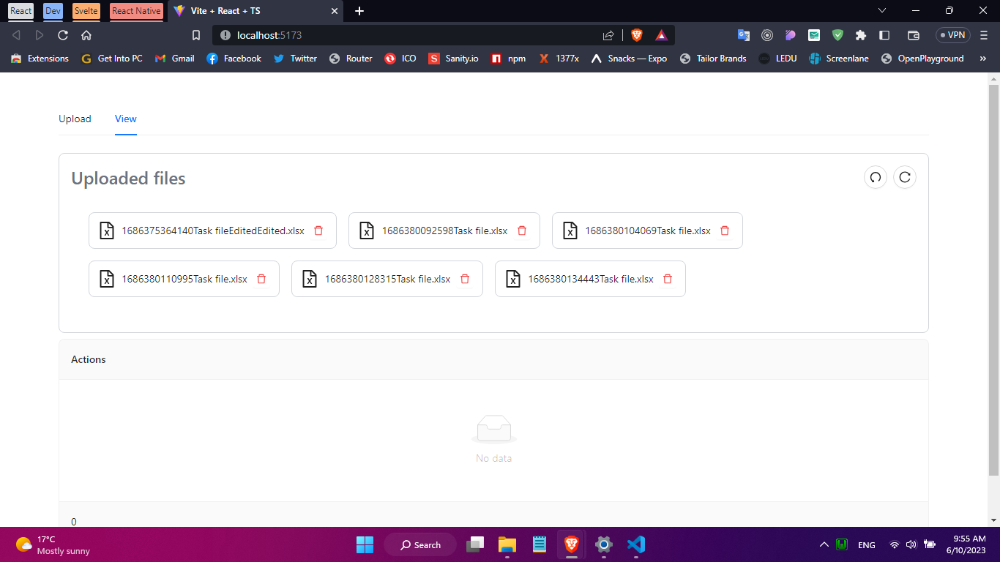
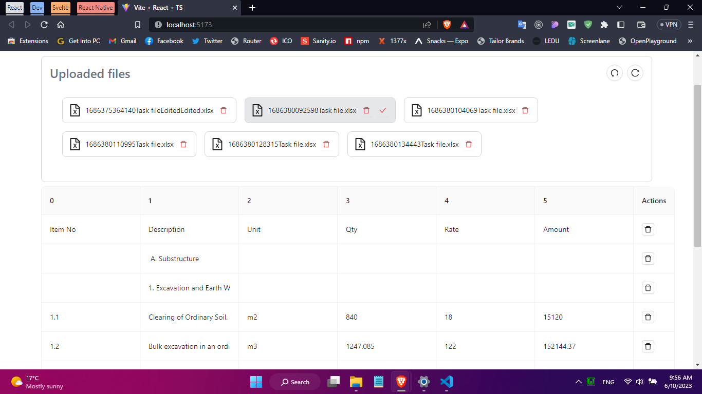
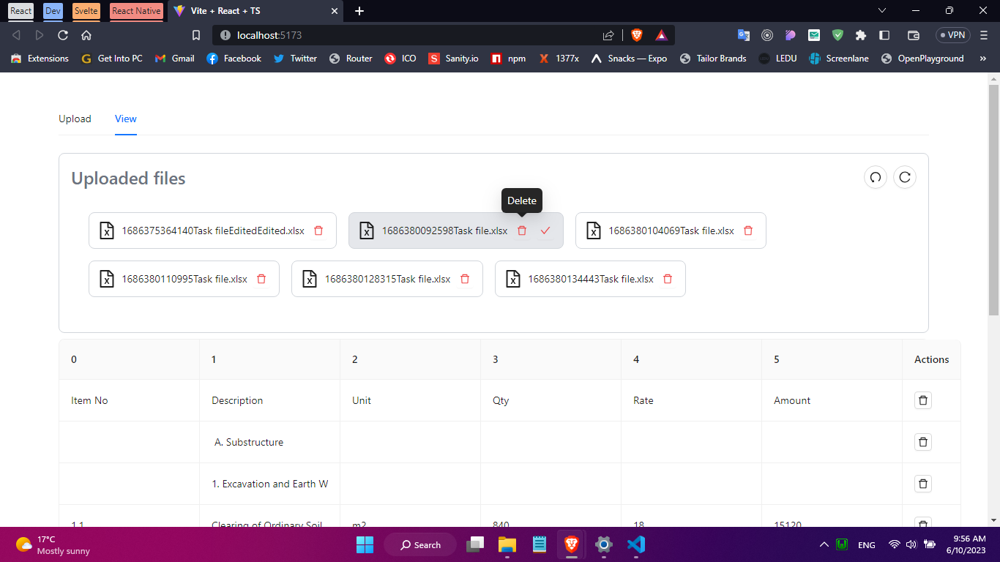
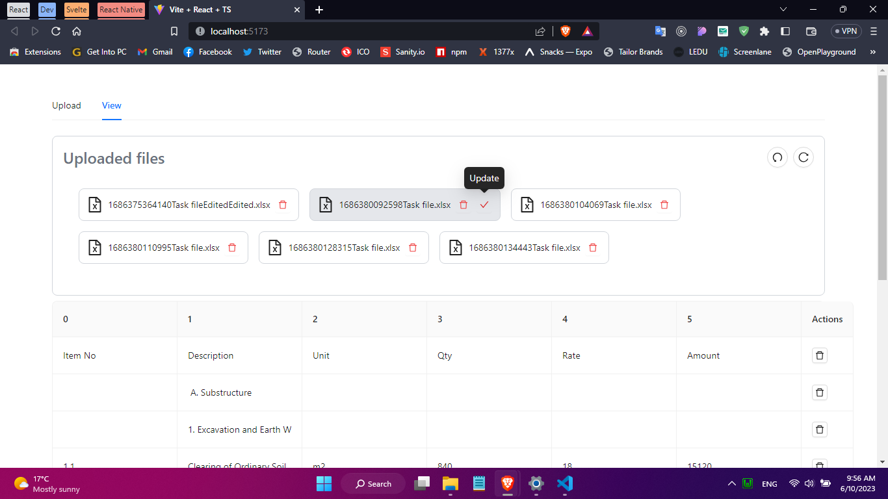

#### Screen to visualize a file and upload

#### Screen to fetch and view files uploaded to the server

#### Select an item to import data to the table

#### Option to delete a file from the server

#### Option to update the file in the server with the table data

